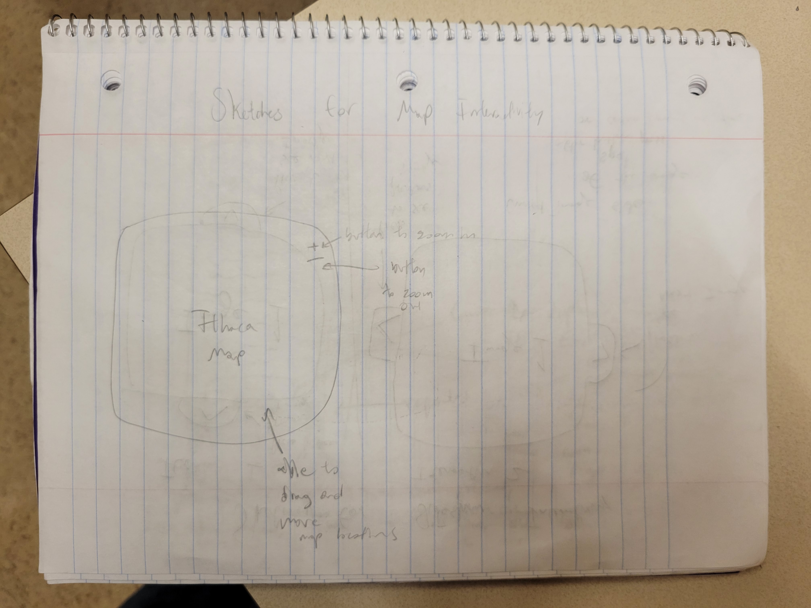
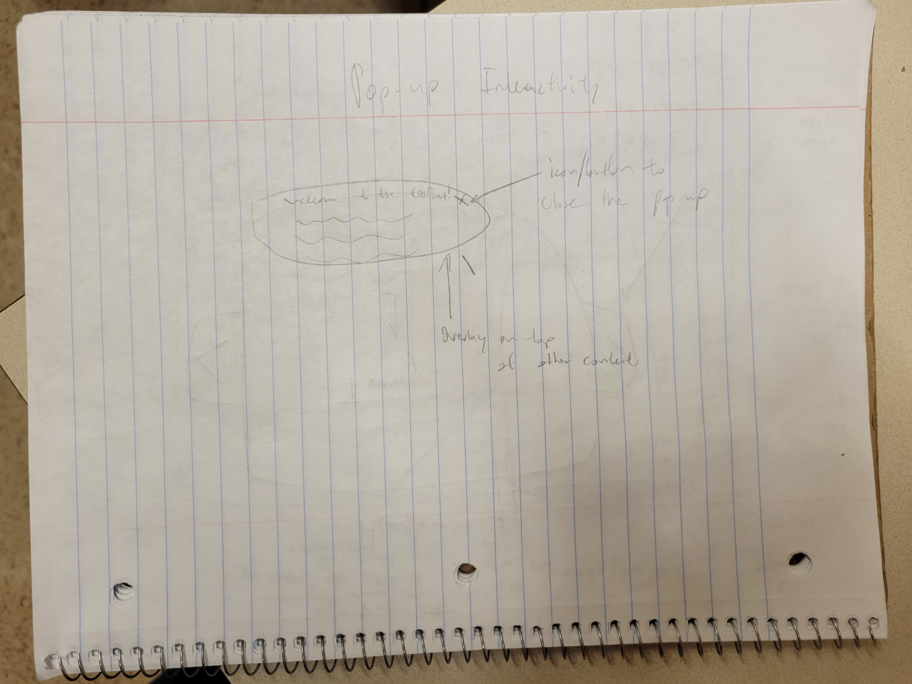
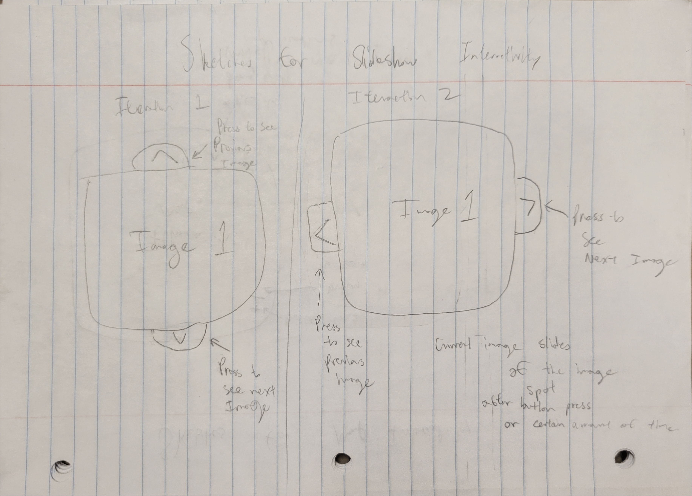
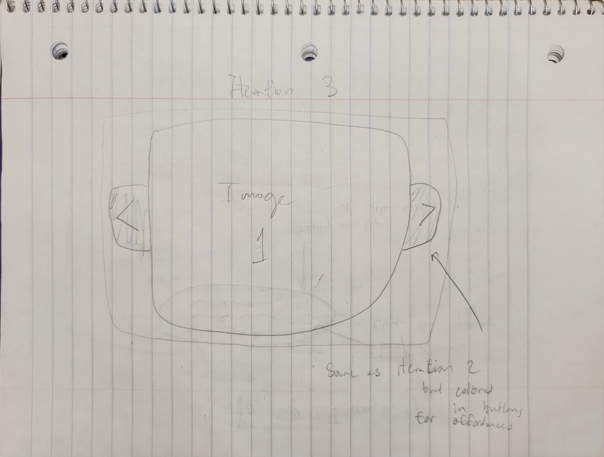
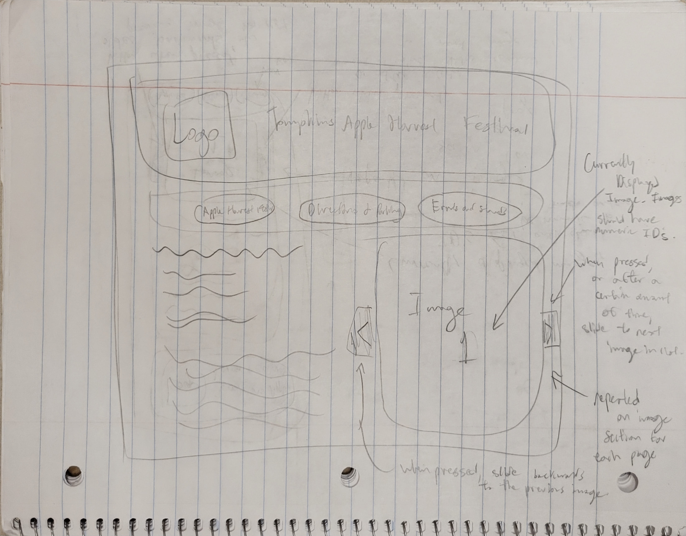
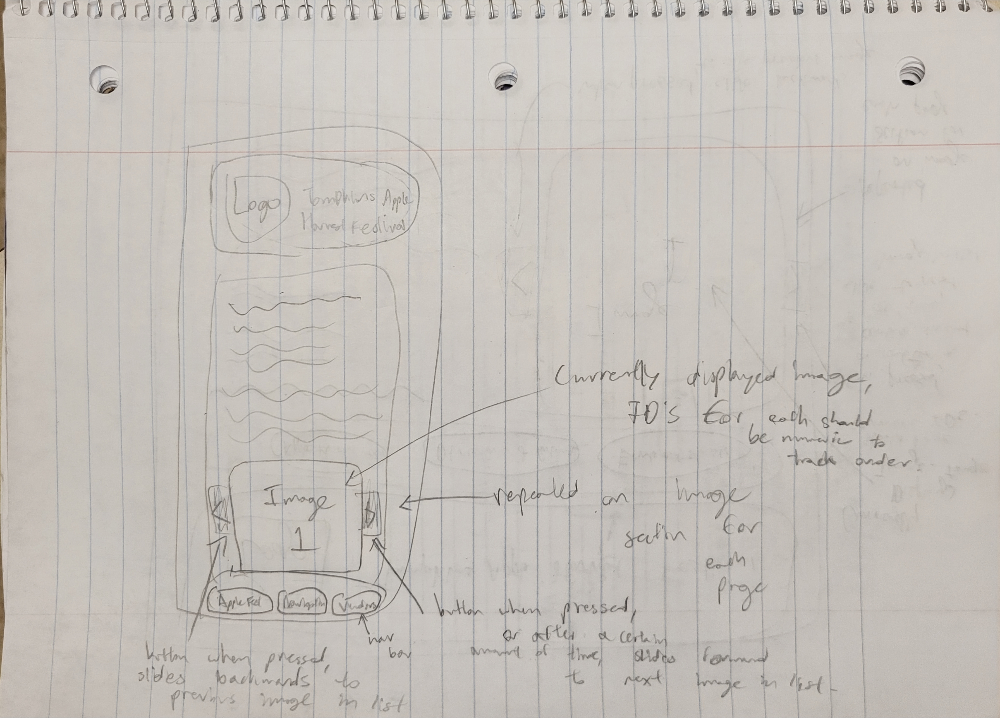

# Project 3: Design Journey

**For each milestone, complete only the sections that are labeled with that milestone.** Refine all sections before the final submission.

You are graded on your design process. If you later need to update your plan, **please do not delete the original plan, leave it in place and append your new plan _below_ the original.** Then explain why you are changing your plan. Any time you update your plan, you're documenting your design process!

**Replace ALL _TODOs_ with your work.** (There should be no TODOs in the final submission.)

Be clear and concise in your writing. Bullets points are encouraged.

**Everything, including images, must be visible in _Markdown: Open Preview_.** If it's not visible in the Markdown preview, then we can't grade it. We also can't give you partial credit either. **Please make sure your design journey should is easy to read for the grader;** in Markdown preview the question _and_ answer should have a blank line between them.


## Existing Project (Milestone 1)

**Tell us about the project you'll be using for Project 3.**

### Project (Milestone 1)
> Which project will you add interactivity to enhance the site's functionality?

Project 2


### Audience (Milestone 1)
> Briefly explain your site's audience.
> Be specific and justify why this audience is a **cohesive** group.

The audience for the Ithaca Apple Harvest Festival site is people in Ithaca and the nearby area who are interested in attending the festival but may be less familar with the Commons or the festival. This is a cohesive audience because everyone within it has similar goals regarding navigation, whether walking, driving, biking, or busing, attending the events, and information they will need there. I have chosen to remove vendors from my original audience because they do not share goals consistent with attendees.


### Audience's Goals (Milestone 1)
> List the audience's goals that you identified in Project 1 or 2.
> Simply list each goal. No need to include the "Design Ideas and Choices", etc.
> You may adjust the goals if necessary.

- Access the times and location of the event
- Learn more beforehand about what will be at Applefest
- Find navigation, parking, and other relevant local travel information for the festival.


## Interactivity Design (Milestone 1)

### Interactivity Brainstorm (Milestone 1)
> Using the audience goals you identified, brainstorm possible options for interactivity to enhance the functionality of the site while also assisting the audience with their goals.
> Briefly explain each idea and provide a brief rationale for how the interactivity enhances the site's functionality for the audience.
> Note: You may find it easier to sketch for brainstorming. That's fine too. Do whatever you need to do to explore your ideas.

- Interactive google maps map on the navigation page that helps users locate the festival dynamically and in relation to themselves.
- Create a pop-up when the website is opened that tells users the location and times of the events immediately so they cannot miss it.
- A slideshow of images that allow users to browse different images and get a better sense of what to expect before visiting the festival.


### Interactivity Design Ideation (Milestone 1)
> Explore the possible design solutions for the interactivity.
> Sketch several iterations of your interactivity.
> Annotate each sketch explaining what happens when a user takes an action. (e.g. When user clicks this, something else appears.)







### Final Interactivity Design (Milestone 1)
> Create _polished_ sketch(es) (it's still a sketch, but with a little more care taken to communicate ideas clearly to the graders) to plan your interactivity.
> **Sketch out the entire page where your interactivity will go.**
> Include your interactivity to the sketch(es).
> Add annotations to explain what happens when the user takes an action.
> Include as many sketches as necessary to communicate your design (ask yourself, could another 1300 take these sketches an implement my design?)





### Interactivity Rationale (Milestone 1)
> Describe the purpose of your proposed interactivity.
> Provide a brief rationale explaining how your proposed interactivity addresses the goals of your site's audience.
> This should be about a paragraph. (3-5 sentences)

My proposed interactivity is the slideshow. This will add dynamic photos that can be accessed either through an automated and timed slideshow or by clicking the buttons left and right of the image. The purpose is to give the audience more content in the same amount of space. That is, while the carousel takes up just about the same space as one image, it can hold essentially as many images as the audience needs. Because the festival is such a visual environment, I believe that providing more images will allow my audience to get a better idea of what to expect at Applefest, especially in terms of visualizations of food offerings and vendor stands.


## Interactivity Implementation Plan (Milestone 1)

### Interactivity Planning Sketches (Milestone 1)
> Produce planning sketches that include all the details another 1300 student would need to implement your interactivity design.


### Interactivity Pseudocode Plan (Milestone 1)
> Write your interactivity pseudocode plan here.
> Pseudocode is not JavaScript. Please do not put JavaScript code here.

```
When the #left-button is clicked, add .hidden to the current image and remove .hidden from the previous image in the list. When #right-button is clicked, or after a counter has reached n counts (n to be determined after testing), add .hidden to the current image and remove .hidden from the next image in the list.
```


### "Ambitious" Interactivity Explanation (Milestone 1)
> In your own words, concisely explain why you believe your interactivity meets the "ambitious" requirement.
> This should be a few sentences. (1-3 sentences)

The slideshow design is ambitious because it not only incorporates concepts covered in class like buttons to hide and unhide images, but also because it requires a list or list-like structure to create an order to the images. It also goes above and beyond by using a counter to determine when enough time has passed to swap to the next slide on its own.


## Grading (Final Submission)

### Interactivity Usability Justification (Final Submission)
> Explain how your design effectively uses affordances, visibility, feedback, and familiarity.
> Write a large paragraph (4-6 sentences)

My slideshow design contains significant uses of affordances, visibility, feedback, and familiarity. For affordances, the left and right button change color when hover over and also change the cursor type to indicate that there is a button to press. For visibility, the relevant parts of interactivity, my buttons with dark borders and green background visibily show the audience of potential interactivity. For feedback, there is obvious effect of a user's actions (or lack of action). By clicking on one of the buttons, the user can see that the image changes, but if they don't click, they will see that the slideshow is on a timer and will also change, eventually also finding that the slideshow loops through five images. The design is lastly familiar to my audience, the left and right buttons imply that the images are in order and user are familiar with this design on other slideshows to know that these buttons are previous and next slide buttons.


### Tell Us What to Grade (Final Submission)
> We aren't re-grading your Project 1 or 2.
> We are only grading the interactivity you added.
> Tell us where (what pages) we can find your interactivity and how to use it.
> **We will only grade what you list here;** if it's not listed, we won't grade it.

The interactive slideshow is on the homepage (index.html, or "Apple Harvest Festival") on the right side if wide and under the first paragraph if narrow. The slideshow uses a left (less than sign) and right button (greater than sign) to indicate buttons that move the slideshow to the previous and next slide respectively. Additionally, after 7 seconds, the slideshow will also progress to the next slide. There are five images in the slideshow, and it loops back through them.


### Collaborators (Final Submission)
> List any persons you collaborated with on this project.

None


### Reference Resources (Final Submission)
> Please cite any external resources you referenced in the creation of your project.
> (i.e. W3Schools, StackOverflow, Mozilla, etc.)

Just the professor "Introductory Interactivity JavaScript Snippets"! It was super helpful.


### Self-Reflection (Final Submission)
> This was the first project in this class where you coded some JavaScript. What did you learn from this experience?

I learned that JavaScript is way less daunting than I initially thought. The snippets provided were extremely helpful because they let me focus on the web development and not get entrenched in coding syntax. I also learned that JavaScript is quite similar to Java, which I have used before, so I actually felt somewhat comfortable with it.


> Take some time here to reflect on how much you've learned since you started this class. It's often easy to ignore our own progress. Take a moment and think about your accomplishments in this class. Hopefully you'll recognize that you've accomplished a lot and that you should be very proud of those accomplishments!

After project 2, I was still shaky on CSS principles. I was putting random CSS properties on everything and not sure how to really use flexboxes. Now, I am extremely comfortable with CSS, looking up documentation, and implementing concepts into my project. Additionally, interactivity came smoothly once nailing down these CSS and HTML skills. I feel like I have a really strong sense of the HTML and CSS fundamentals and design process. I hope to feel the same way about JavaScript soon!
